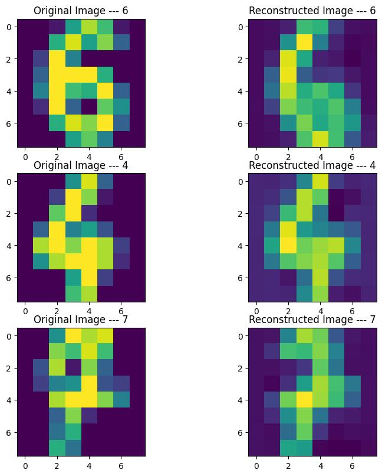

# Neural Image Compressor
Image compression using Deep learning

My simple implementation is based on [Jmtomczak 's blog](https://jmtomczak.github.io/blog/8/8_neural_compression.html).

# Set up env
- Using conda
```commandline
conda init env
conda activate env
pip install -r requirement.txt
```
You can set up your hyperparameters in ```./config/config_hy```
# Train:
```commandline
python3 train.py
```
# Reconstruct:
- Reconstruct some random images in [Digits dataset](https://scikit-learn.org/stable/auto_examples/datasets/plot_digits_last_image.html):
```commandline
python3 reconstruct.py --checkpoint_path <your checkpoint received after training in ./data/checkpoint>
```
- Result will be saved at ```./images/sample_reconstruct.jpg```
# Demo:
- You can try it yourself (cuz its training phase is extremely fast :smile:)


